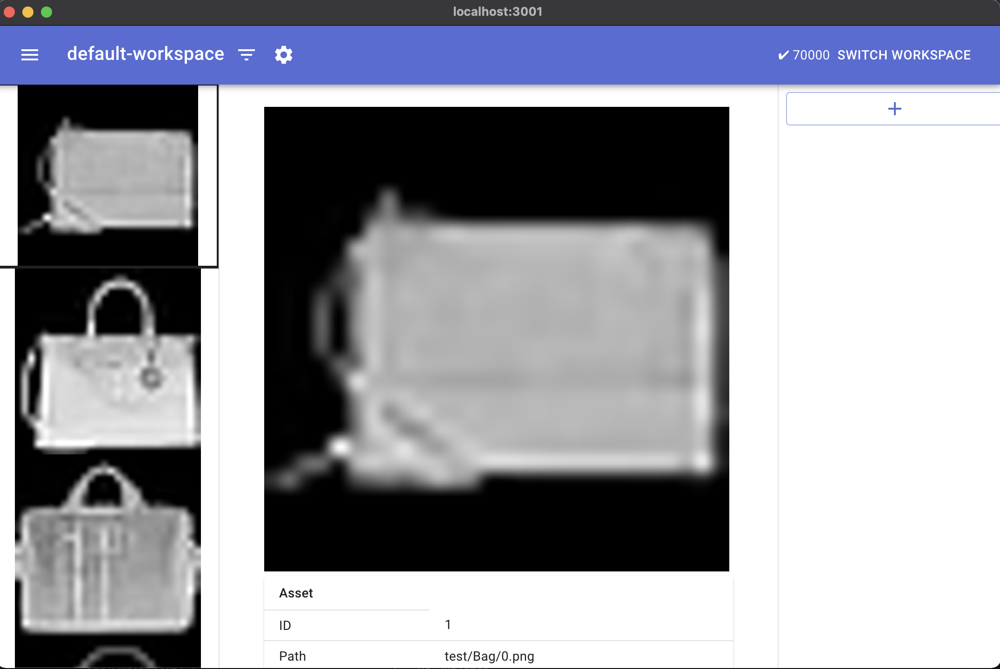
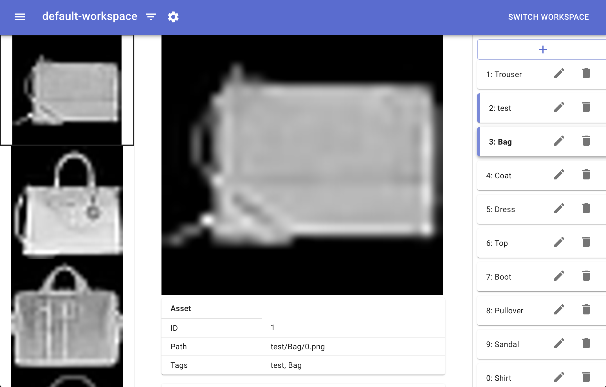
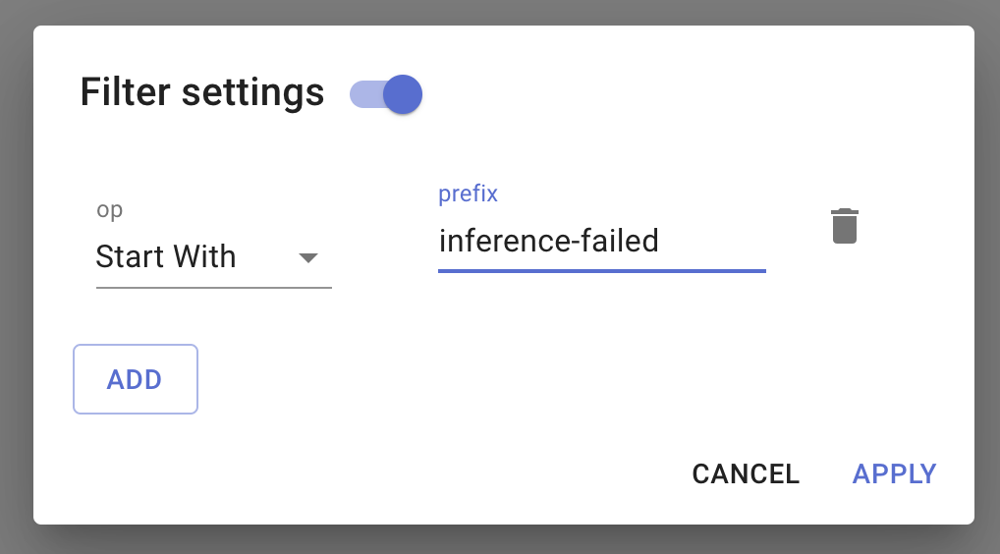
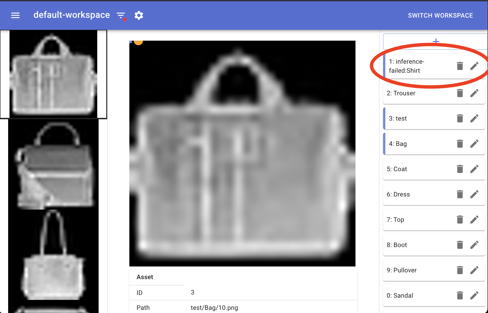

# fashion mnist example

This tutorial shows how you can check, annotate, and analyze images on [imagine-app](https://github.com/mpppk/imagine) by using [fashion-mnist](https://github.com/zalandoresearch/fashion-mnist) dataset as an example.

## Prerequisites

- Install [imagine-app](https://github.com/mpppk/imagine)
- Install [imagine-utl](https://github.com/mpppk/imagine-utl)

## Setup

```shell
$ git clone https://github.com/mpppk/imagine-samples
$ cd imagine-samples/fashion_mnist
```

## Download fashion-mnist dataset

First you should download fashion-mnist dataset. This repository provides multiple way so you can select the one you like.

### Python

```shell
python dowload.py
```

### Docker

```shell
$ docker run \
    -u (id -u):(id -g) \
    -v (pwd)/dataset/train:/train \
    -v (pwd)/dataset/test:/test \
    mpppk/fashion_mnist_downloader
```

### docker-compose

```shell
$ docker-compose up
```

## Launch imagine-app

```shell
$ imagine --db db.imagine --basepath $(PWD)/dataset
```

You should see a screen like the one below.



## Import tags from directory name

You can see images of dataset on imagine-app, but they does not have any tags yet.

The fashion mnist dataset has the following directory structure, so by referring to these directory names, you can find out which category an image belongs to and whether it is training data or test data.

```shell
$ tree -L 2 dataset
.
├── test
│   ├── Bag
│   ├── Boot
│   ├── Coat
│   ├── Dress
│   ├── Pullover
│   ├── Sandal
│   ├── Shirt
│   ├── Sneaker
│   ├── Top
│   └── Trouser
└── train
    ├── Bag
    ├── Boot
    ├── Coat
    ├── Dress
    ├── Pullover
    ├── Sandal
    ├── Shirt
    ├── Sneaker
    ├── Top
    └── Trouser
```

You can import tags from directory name by using imagine-utl command. It print image and tag information to stdout.

```shell
$ imagine-utl load --dir dataset --depth 2 | head -n 2
{"name":"0","path":"test/Bag/0.png","boundingBoxes":[{"TagName":"test"},{"TagName":"Bag"}]}
{"name":"1","path":"test/Bag/1.png","boundingBoxes":[{"TagName":"test"},{"TagName":"Bag"}]}
```

So you can import tags by piping the output to the imagine command.

(Note that the imagine-app DB file cannot be accessed by multiple processes at the same time, so you must exit imagine-app before importing it.)

```shell
$ imagine-utl load --dir dataset --depth 2 | imagine asset update --db db.imagine
```

Then, reopen imagine-app.

(imagine-app remembers the base path once specified. Therefore, it is not necessary to specify the base path flag for the second and subsequent startups.)

```shell
$ imagine --db db.imagine
```

Now you can see tags on right list. highlighted tags are annotated to selected image.



## Export metadata

You can export images meta data by below command. This is useful when you want to use annotations with other tools.

```shell
$ imagine --db db.imagine asset list --format csv | head -n 2
"id","path","tags"
"1","test/Bag/0.png","test,Bag"
```

## Update metadata

Suppose a situation where you want to check the inference result of the created machine learning model on imagine-app. `incorrect_predicts.csv` contains incorrect inference results, like below.

```csv
Bag,Boot,Coat,Dress,Pullover,Sandal,Shirt,Sneaker,Top,Trouser,predict,actual,path
0.09600647,0.1303275,0.080824696,0.117921434,0.06790708,0.075323775,0.15818310000000002,0.07472554599999999,0.11275013,0.08603032,Shirt,Bag,test/Bag/1.png
0.09600647,0.1303275,0.080824696,0.117921434,0.06790708,0.075323775,0.15818310000000002,0.07472554599999999,0.11275013,0.08603032,Shirt,Bag,test/Bag/10.png
```

The first 10 columns show the probabilities of each category determined by the model. The prerdict column is the category determined by the model, and actual column is the actual category.

`converted_incorrect_predicts.jsonl` is json line file which includes predict and actual label for each images, like below.

```jsonl
{"path": "test/Bag/1.png", "boundingBoxes": [{"tagName": "inference-failed:Shirt"}]}
{"path": "test/Bag/10.png", "boundingBoxes": [{"tagName": "inference-failed:Shirt"}]}
...
```

This file is generated from `incorrect_predicts.csv`, by `convert_incorrect_predicts.py`.

To import the jsonl file, execute below command.

```shell
$ imagine --db db.imagine asset update < converted_incorrect_results.jsonl
```

or output jsonl to stdout by python script and pipe to imagine-app directly.

```shell
$ python convert_incorect_predicts.py incorrect_predicts.csv | imagine --db db.imagine asset update
```

Now incorrect results are imported to imagine-app, so let's check on app!

```shell
$ imagine --db db.imagine
```




By filter images with `start-with` query, you can see incorrect predict results.(`inference-failed` tags may be on bottom of tag list)
